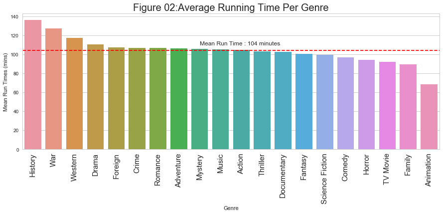
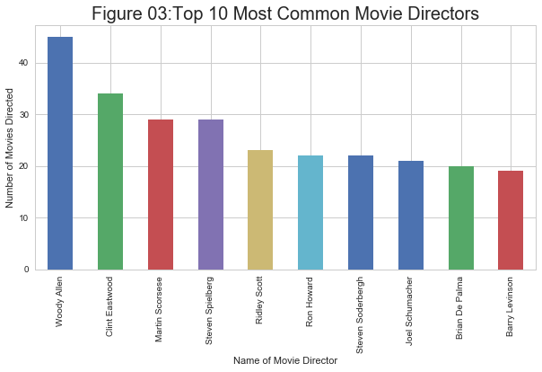
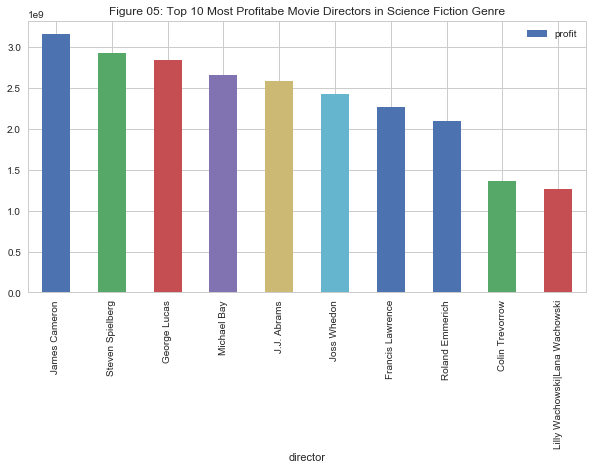
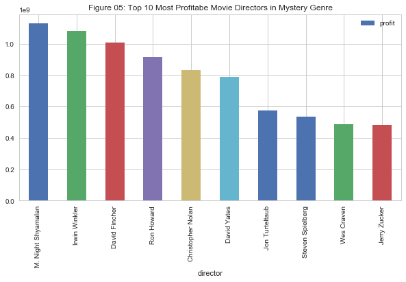
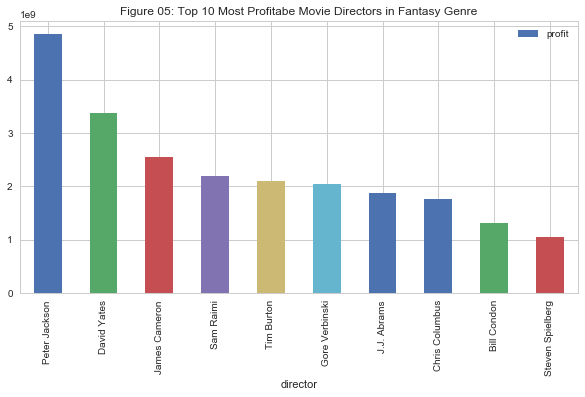
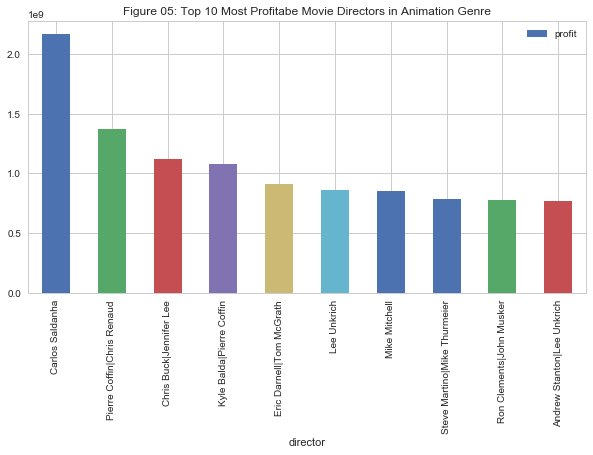
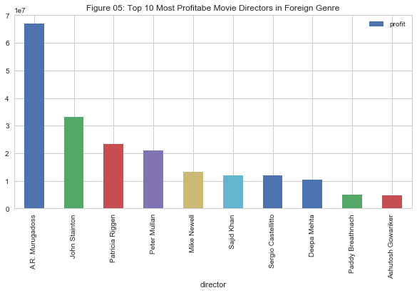

Title: Movie tmdb EDA in Python
Author: Amit Shankar
Date: 5/7/2018
Tags: data analyst nanodegree, python, eda
Summary: This is the third project of term one in the data analyst nanodegree program. This project reads TMDb movie dataset and performs EDA using jupyter python.
 

<a id='top'> </a>
This project explores the TMDb movie data set from Udacity's curated data site. 
The dataset can be found [here](https://github.com/amitshankar/Udacity/tree/master/Data_Analyst_Nanodegree/Term_01/Project_03/data) and the jupyter script is [here](*****). The data set contains information on approximately 10,000 movies.
Also brief overview can be found [here](#overview).
<br>
<br>
Questions that will be investigated:
<br>[What were the 10 most profitable movies?](#link_01)
<br>[Find the most profitable movie in each genre?](#link_02)
<br>[What were the most profitable movies in each year?](#link_03)
<br>[What is the average lenght of movies in each genre?](#link_04)
<br>[Who are the top 10 most common movie directors?](#link_05)
<br>[Which movie directors made movies that made the most profit?](#link_06)
<br>[List the most profitable movie director in each genre?](#link_07)
<br>[Are there any directors that standout and appear in  multiple genres for the top 10 movies directored? ](#link_08)

<br>
Assumptions: While exploring the dataset, I assumed that : <br>
                profitablity of a movie = revenue  - budget

<br> References can be found [here](#reference).


 


```python

```


```python
import numpy as np
import pandas as pd
import matplotlib as mpl
import matplotlib.pyplot as plt
import seaborn as sns
sns.set(style="whitegrid", color_codes=True)
import ipywidgets as wg
from ipywidgets import interact, interactive, fixed, interact_manual
from IPython.display import display

%matplotlib inline
```


```python

```


```python
#Function reads the movie dataset and formats the date
def read_format_file():
    tmp=pd.read_csv('data/tmdb-movies.csv')

    #convert release date to date format
    release_date=pd.to_datetime(tmp['release_date'])

    #add a profit column 
    tmp['profit']=tmp.revenue-tmp.budget
    
    return tmp
```


```python
df=read_format_file()
#df.head(2)
df.info()
```

    <class 'pandas.core.frame.DataFrame'>
    RangeIndex: 10866 entries, 0 to 10865
    Data columns (total 22 columns):
    id                      10866 non-null int64
    imdb_id                 10856 non-null object
    popularity              10866 non-null float64
    budget                  10866 non-null int64
    revenue                 10866 non-null int64
    original_title          10866 non-null object
    cast                    10790 non-null object
    homepage                2936 non-null object
    director                10822 non-null object
    tagline                 8042 non-null object
    keywords                9373 non-null object
    overview                10862 non-null object
    runtime                 10866 non-null int64
    genres                  10843 non-null object
    production_companies    9836 non-null object
    release_date            10866 non-null object
    vote_count              10866 non-null int64
    vote_average            10866 non-null float64
    release_year            10866 non-null int64
    budget_adj              10866 non-null float64
    revenue_adj             10866 non-null float64
    profit                  10866 non-null int64
    dtypes: float64(4), int64(7), object(11)
    memory usage: 1.8+ MB
    

<a id='overview'> </a>

## Brief Overview of the Dataset
[Go to top](#top)


```python
print('The movies analyzed are from ', df.release_year.min(),' to ',df.release_year.max(),'.',sep='',end='')

print(' The most profitable movie is ',df.iloc[df.profit.idxmax()].original_title,' with a budget of ',
      '${:,.2f}'.format(df.iloc[df.profit.idxmax()].budget),' and revenue of ',
      '${:,.2f}'.format(df.iloc[df.profit.idxmax()].revenue),' and profit of ',
      '${:,.2f}'.format(df.iloc[df.profit.idxmax()].profit),'.',sep='', end='')

print(' ',df.iloc[df.profit.idxmin()].original_title,' was a finacial disaster as it lost ',
      '${:,.2f}'.format(abs(df.iloc[df.profit.idxmin()].profit)),'.', sep='',end='')

#print(' next line test') 
```

    The movies analyzed are from 1960 to 2015. The most profitable movie is Avatar with a budget of $237,000,000.00 and revenue of $2,781,505,847.00 and profit of $2,544,505,847.00. The Warrior's Way was a finacial disaster as it lost $413,912,431.00.


```python

```

<a id='link_01'> </a>
## What were the 10 most profitable movies?
[Go to top](#top)


```python
#input: function takes the movie dataset and n - the top n number of profitable movies
#process: function finds the most profitable movies
#out: function returns a graph of most profitable movies
def top_profitable_movies(df,n):
    tmp_01=df.sort_values(by=['profit'],ascending=False)[['original_title','release_year','profit']].head(n)
    f, ax = plt.subplots(figsize=(10, 3))
    ax=sns.stripplot(x="original_title", y='profit',hue='release_year',data=tmp_01)
    ax.set_xticklabels(ax.get_xticklabels(),rotation=90,fontsize=15)
    ax.set_title('Figure 01:Top '+ str(n) + ' Profitable Movies',fontsize=20)
    ax.set_xlabel('Movie Names')
    ax.set_ylabel('Profit Generated $');

```


```python
top_profitable_movies(df,10)
```


Observation: As stated earlier, Avatar was the most profitable move that came out in 2009.Year 2015 was exciting for movie goers
as there were 4 movies that attracted a lot of attention: Starwars:The Force Awakens, Jurassic World, Furious 7 and Avengers:Age of Ultron.


```python

```

<a id='link_02'> </a>
## Find the most profitable movie in each genre?
[Go to top](#top)


```python
#input: function takes in the movie dataset
#process: calculates the most profitable movie in each genre
#output: returns a dataframe of most profitable movie in each genre
def profitable_movies_in_each_genre(df):
    genres=df['genres'].str.split('|', expand=True) #split the genres by |
    tmp_01=pd.concat([df.profit,df.release_year,df.original_title,genres],axis=1) 
    #melt the genres columns into one column 
    tmp_02=pd.melt(tmp_01,id_vars=['profit','release_year','original_title'],value_name='genre') 
    tmp_02=tmp_02.drop(columns=['variable']) #drop variable column generated during melt
    tmp_02=tmp_02.loc[tmp_02.genre.notna()] # remove nan, None from genre column
    tmp_03=pd.concat([tmp_02.genre,tmp_02.profit],axis=1) #lets get the index first using only two columns
    ind=tmp_03.groupby(['genre']).idxmax().reset_index().profit.values #get the index of most profitable genres
    top_genres=tmp_02.loc[ind]
    return top_genres
```


```python
profitable_movies_in_each_genre(df)
```


<div>
<style scoped>
    .dataframe tbody tr th:only-of-type {
        vertical-align: middle;
    }

    .dataframe tbody tr th {
        vertical-align: top;
    }

    .dataframe thead th {
        text-align: right;
    }
</style>
<table border="1" class="dataframe">
  <thead>
    <tr style="text-align: right;">
      <th></th>
      <th>profit</th>
      <th>release_year</th>
      <th>original_title</th>
      <th>genre</th>
    </tr>
  </thead>
  <tbody>
    <tr>
      <th>1386</th>
      <td>2544505847</td>
      <td>2009</td>
      <td>Avatar</td>
      <td>Action</td>
    </tr>
    <tr>
      <th>12252</th>
      <td>2544505847</td>
      <td>2009</td>
      <td>Avatar</td>
      <td>Adventure</td>
    </tr>
    <tr>
      <th>5422</th>
      <td>1124219009</td>
      <td>2013</td>
      <td>Frozen</td>
      <td>Animation</td>
    </tr>
    <tr>
      <th>32606</th>
      <td>1082730962</td>
      <td>2015</td>
      <td>Minions</td>
      <td>Comedy</td>
    </tr>
    <tr>
      <th>10870</th>
      <td>1316249360</td>
      <td>2015</td>
      <td>Furious 7</td>
      <td>Crime</td>
    </tr>
    <tr>
      <th>7049</th>
      <td>113114517</td>
      <td>2004</td>
      <td>Fahrenheit 9/11</td>
      <td>Documentary</td>
    </tr>
    <tr>
      <th>5231</th>
      <td>1645034188</td>
      <td>1997</td>
      <td>Titanic</td>
      <td>Drama</td>
    </tr>
    <tr>
      <th>14240</th>
      <td>1202817822</td>
      <td>2011</td>
      <td>Harry Potter and the Deathly Hallows: Part 2</td>
      <td>Family</td>
    </tr>
    <tr>
      <th>23118</th>
      <td>2544505847</td>
      <td>2009</td>
      <td>Avatar</td>
      <td>Fantasy</td>
    </tr>
    <tr>
      <th>24967</th>
      <td>66900000</td>
      <td>2008</td>
      <td>Ghajini</td>
      <td>Foreign</td>
    </tr>
    <tr>
      <th>19840</th>
      <td>411840909</td>
      <td>1998</td>
      <td>Saving Private Ryan</td>
      <td>History</td>
    </tr>
    <tr>
      <th>9806</th>
      <td>463654000</td>
      <td>1975</td>
      <td>Jaws</td>
      <td>Horror</td>
    </tr>
    <tr>
      <th>40869</th>
      <td>386006740</td>
      <td>1992</td>
      <td>The Bodyguard</td>
      <td>Music</td>
    </tr>
    <tr>
      <th>29826</th>
      <td>1084279658</td>
      <td>1995</td>
      <td>The Net</td>
      <td>Mystery</td>
    </tr>
    <tr>
      <th>16097</th>
      <td>1645034188</td>
      <td>1997</td>
      <td>Titanic</td>
      <td>Romance</td>
    </tr>
    <tr>
      <th>33984</th>
      <td>2544505847</td>
      <td>2009</td>
      <td>Avatar</td>
      <td>Science Fiction</td>
    </tr>
    <tr>
      <th>8615</th>
      <td>37000000</td>
      <td>1996</td>
      <td>Doctor Who</td>
      <td>TV Movie</td>
    </tr>
    <tr>
      <th>26963</th>
      <td>1645034188</td>
      <td>1997</td>
      <td>Titanic</td>
      <td>Thriller</td>
    </tr>
    <tr>
      <th>19</th>
      <td>490523427</td>
      <td>2015</td>
      <td>The Hunger Games: Mockingjay - Part 2</td>
      <td>War</td>
    </tr>
    <tr>
      <th>31717</th>
      <td>402208848</td>
      <td>1990</td>
      <td>Dances with Wolves</td>
      <td>Western</td>
    </tr>
  </tbody>
</table>
</div>


Observation:Avatar (2009) was profitable in multiple genres: action, adventure, fantasy and sciene fiction. Its interesting to see that Jaws which came out in 1975 was most profitable in horror genre considering it was a very old movie but still holding its ground.Also, interesting to note that Titanic was most profitable in drama, romance and thriller. It seems that top profitable movies are profitable in multiple genres - although this could be further investigated. 


```python

```

<a id='link_03'> </a>
## What were the most profitable movies in each year?
[Go to top](#top)


```python
#input: function takes the movie dataset
#process: function calculates the most profitable movie each year
#out: function returns a dataframe of most profitable movies per year
def profitable_movie_per_year(df):
    ind=df.groupby('release_year')['profit'].idxmax().values
    top_yearly_movies=df.iloc[ind][['release_year','original_title','genres','director','profit']]
    return top_yearly_movies
```


```python
profitable_movie_per_year(df)
```


<div>
<style scoped>
    .dataframe tbody tr th:only-of-type {
        vertical-align: middle;
    }

    .dataframe tbody tr th {
        vertical-align: top;
    }

    .dataframe thead th {
        text-align: right;
    }
</style>
<table border="1" class="dataframe">
  <thead>
    <tr style="text-align: right;">
      <th></th>
      <th>release_year</th>
      <th>original_title</th>
      <th>genres</th>
      <th>director</th>
      <th>profit</th>
    </tr>
  </thead>
  <tbody>
    <tr>
      <th>10143</th>
      <td>1960</td>
      <td>Spartacus</td>
      <td>Action|Drama|History</td>
      <td>Stanley Kubrick</td>
      <td>48000000</td>
    </tr>
    <tr>
      <th>10110</th>
      <td>1961</td>
      <td>One Hundred and One Dalmatians</td>
      <td>Adventure|Animation|Comedy|Family</td>
      <td>Clyde Geronimi|Hamilton Luske|Wolfgang Reitherman</td>
      <td>211880014</td>
    </tr>
    <tr>
      <th>9849</th>
      <td>1962</td>
      <td>Dr. No</td>
      <td>Adventure|Action|Thriller</td>
      <td>Terence Young</td>
      <td>58500000</td>
    </tr>
    <tr>
      <th>10438</th>
      <td>1963</td>
      <td>From Russia With Love</td>
      <td>Action|Thriller|Adventure</td>
      <td>Terence Young</td>
      <td>76398765</td>
    </tr>
    <tr>
      <th>9881</th>
      <td>1964</td>
      <td>Goldfinger</td>
      <td>Adventure|Action|Thriller</td>
      <td>Guy Hamilton</td>
      <td>121400000</td>
    </tr>
    <tr>
      <th>10690</th>
      <td>1965</td>
      <td>The Sound of Music</td>
      <td>Drama|Family|Music|Romance</td>
      <td>Robert Wise</td>
      <td>155014286</td>
    </tr>
    <tr>
      <th>10822</th>
      <td>1966</td>
      <td>Who's Afraid of Virginia Woolf?</td>
      <td>Drama</td>
      <td>Mike Nichols</td>
      <td>26236689</td>
    </tr>
    <tr>
      <th>10398</th>
      <td>1967</td>
      <td>The Jungle Book</td>
      <td>Family|Animation|Adventure</td>
      <td>Wolfgang Reitherman</td>
      <td>201843612</td>
    </tr>
    <tr>
      <th>9719</th>
      <td>1968</td>
      <td>2001: A Space Odyssey</td>
      <td>Science Fiction|Mystery|Adventure</td>
      <td>Stanley Kubrick</td>
      <td>44715371</td>
    </tr>
    <tr>
      <th>10725</th>
      <td>1969</td>
      <td>Butch Cassidy and the Sundance Kid</td>
      <td>History|Drama|Western|Crime</td>
      <td>George Roy Hill</td>
      <td>96308889</td>
    </tr>
    <tr>
      <th>10654</th>
      <td>1970</td>
      <td>Love Story</td>
      <td>Drama|Romance</td>
      <td>Arthur Hiller</td>
      <td>134200000</td>
    </tr>
    <tr>
      <th>9925</th>
      <td>1971</td>
      <td>Diamonds Are Forever</td>
      <td>Adventure|Action|Thriller|Science Fiction</td>
      <td>Guy Hamilton</td>
      <td>108800000</td>
    </tr>
    <tr>
      <th>7269</th>
      <td>1972</td>
      <td>The Godfather</td>
      <td>Drama|Crime</td>
      <td>Francis Ford Coppola</td>
      <td>239066411</td>
    </tr>
    <tr>
      <th>10594</th>
      <td>1973</td>
      <td>The Exorcist</td>
      <td>Drama|Horror|Thriller</td>
      <td>William Friedkin</td>
      <td>433306145</td>
    </tr>
    <tr>
      <th>9767</th>
      <td>1974</td>
      <td>Blazing Saddles</td>
      <td>Comedy|Western</td>
      <td>Mel Brooks</td>
      <td>116900000</td>
    </tr>
    <tr>
      <th>9806</th>
      <td>1975</td>
      <td>Jaws</td>
      <td>Horror|Thriller|Adventure</td>
      <td>Steven Spielberg</td>
      <td>463654000</td>
    </tr>
    <tr>
      <th>10208</th>
      <td>1976</td>
      <td>A Star Is Born</td>
      <td>Drama|Music|Romance</td>
      <td>Frank Pierson</td>
      <td>155000000</td>
    </tr>
    <tr>
      <th>1329</th>
      <td>1977</td>
      <td>Star Wars</td>
      <td>Adventure|Action|Science Fiction</td>
      <td>George Lucas</td>
      <td>764398007</td>
    </tr>
    <tr>
      <th>10758</th>
      <td>1978</td>
      <td>Superman</td>
      <td>Adventure|Fantasy|Action|Science Fiction</td>
      <td>Richard Donner</td>
      <td>245218018</td>
    </tr>
    <tr>
      <th>7833</th>
      <td>1979</td>
      <td>Rocky II</td>
      <td>Drama</td>
      <td>Sylvester Stallone</td>
      <td>193182160</td>
    </tr>
    <tr>
      <th>7309</th>
      <td>1980</td>
      <td>The Empire Strikes Back</td>
      <td>Adventure|Action|Science Fiction</td>
      <td>Irvin Kershner</td>
      <td>520400000</td>
    </tr>
    <tr>
      <th>8375</th>
      <td>1981</td>
      <td>Raiders of the Lost Ark</td>
      <td>Adventure|Action</td>
      <td>Steven Spielberg</td>
      <td>371925971</td>
    </tr>
    <tr>
      <th>8889</th>
      <td>1982</td>
      <td>E.T. the Extra-Terrestrial</td>
      <td>Science Fiction|Adventure|Family|Fantasy</td>
      <td>Steven Spielberg</td>
      <td>782410554</td>
    </tr>
    <tr>
      <th>7987</th>
      <td>1983</td>
      <td>Return of the Jedi</td>
      <td>Adventure|Action|Science Fiction</td>
      <td>Richard Marquand</td>
      <td>540350000</td>
    </tr>
    <tr>
      <th>7883</th>
      <td>1984</td>
      <td>Indiana Jones and the Temple of Doom</td>
      <td>Adventure|Action</td>
      <td>Steven Spielberg</td>
      <td>305000000</td>
    </tr>
    <tr>
      <th>6081</th>
      <td>1985</td>
      <td>Back to the Future</td>
      <td>Adventure|Comedy|Science Fiction|Family</td>
      <td>Robert Zemeckis</td>
      <td>362109762</td>
    </tr>
    <tr>
      <th>10475</th>
      <td>1986</td>
      <td>Top Gun</td>
      <td>Drama|Action|Romance</td>
      <td>Tony Scott</td>
      <td>341830601</td>
    </tr>
    <tr>
      <th>9613</th>
      <td>1987</td>
      <td>Fatal Attraction</td>
      <td>Horror|Drama|Romance|Thriller</td>
      <td>Adrian Lyne</td>
      <td>306145693</td>
    </tr>
    <tr>
      <th>9454</th>
      <td>1988</td>
      <td>Rain Man</td>
      <td>Drama</td>
      <td>Barry Levinson</td>
      <td>329825435</td>
    </tr>
    <tr>
      <th>9180</th>
      <td>1989</td>
      <td>Indiana Jones and the Last Crusade</td>
      <td>Adventure|Action</td>
      <td>Steven Spielberg</td>
      <td>426171806</td>
    </tr>
    <tr>
      <th>9986</th>
      <td>1990</td>
      <td>Ghost</td>
      <td>Fantasy|Drama|Thriller|Mystery|Romance</td>
      <td>Jerry Zucker</td>
      <td>483000000</td>
    </tr>
    <tr>
      <th>9317</th>
      <td>1991</td>
      <td>Terminator 2: Judgment Day</td>
      <td>Action|Thriller|Science Fiction</td>
      <td>James Cameron</td>
      <td>420000000</td>
    </tr>
    <tr>
      <th>8243</th>
      <td>1992</td>
      <td>Aladdin</td>
      <td>Animation|Family|Comedy|Adventure|Fantasy</td>
      <td>Ron Clements|John Musker</td>
      <td>476050219</td>
    </tr>
    <tr>
      <th>10223</th>
      <td>1993</td>
      <td>Jurassic Park</td>
      <td>Adventure|Science Fiction</td>
      <td>Steven Spielberg</td>
      <td>857100000</td>
    </tr>
    <tr>
      <th>4180</th>
      <td>1994</td>
      <td>The Lion King</td>
      <td>Family|Animation|Drama</td>
      <td>Roger Allers|Rob Minkoff</td>
      <td>743241776</td>
    </tr>
    <tr>
      <th>8094</th>
      <td>1995</td>
      <td>The Net</td>
      <td>Crime|Drama|Mystery|Thriller|Action</td>
      <td>Irwin Winkler</td>
      <td>1084279658</td>
    </tr>
    <tr>
      <th>8457</th>
      <td>1996</td>
      <td>Independence Day</td>
      <td>Action|Adventure|Science Fiction</td>
      <td>Roland Emmerich</td>
      <td>741969268</td>
    </tr>
    <tr>
      <th>5231</th>
      <td>1997</td>
      <td>Titanic</td>
      <td>Drama|Romance|Thriller</td>
      <td>James Cameron</td>
      <td>1645034188</td>
    </tr>
    <tr>
      <th>8970</th>
      <td>1998</td>
      <td>Armageddon</td>
      <td>Action|Thriller|Science Fiction|Adventure</td>
      <td>Michael Bay</td>
      <td>413799566</td>
    </tr>
    <tr>
      <th>2412</th>
      <td>1999</td>
      <td>Star Wars: Episode I - The Phantom Menace</td>
      <td>Adventure|Action|Science Fiction</td>
      <td>George Lucas</td>
      <td>809317558</td>
    </tr>
    <tr>
      <th>8666</th>
      <td>2000</td>
      <td>Mission: Impossible II</td>
      <td>Adventure|Action|Thriller</td>
      <td>John Woo</td>
      <td>421388105</td>
    </tr>
    <tr>
      <th>2634</th>
      <td>2001</td>
      <td>Harry Potter and the Philosopher's Stone</td>
      <td>Adventure|Fantasy|Family</td>
      <td>Chris Columbus</td>
      <td>851475550</td>
    </tr>
    <tr>
      <th>3911</th>
      <td>2002</td>
      <td>The Lord of the Rings: The Two Towers</td>
      <td>Adventure|Fantasy|Action</td>
      <td>Peter Jackson</td>
      <td>847287400</td>
    </tr>
    <tr>
      <th>4949</th>
      <td>2003</td>
      <td>The Lord of the Rings: The Return of the King</td>
      <td>Adventure|Fantasy|Action</td>
      <td>Peter Jackson</td>
      <td>1024888979</td>
    </tr>
    <tr>
      <th>6977</th>
      <td>2004</td>
      <td>Shrek 2</td>
      <td>Adventure|Animation|Comedy|Family|Fantasy</td>
      <td>Andrew Adamson|Kelly Asbury|Conrad Vernon</td>
      <td>769838758</td>
    </tr>
    <tr>
      <th>6190</th>
      <td>2005</td>
      <td>Harry Potter and the Goblet of Fire</td>
      <td>Adventure|Fantasy|Family</td>
      <td>Mike Newell</td>
      <td>745921036</td>
    </tr>
    <tr>
      <th>6555</th>
      <td>2006</td>
      <td>Pirates of the Caribbean: Dead Man's Chest</td>
      <td>Adventure|Fantasy|Action</td>
      <td>Gore Verbinski</td>
      <td>865659812</td>
    </tr>
    <tr>
      <th>7388</th>
      <td>2007</td>
      <td>Harry Potter and the Order of the Phoenix</td>
      <td>Adventure|Fantasy|Family|Mystery</td>
      <td>David Yates</td>
      <td>788212738</td>
    </tr>
    <tr>
      <th>2875</th>
      <td>2008</td>
      <td>The Dark Knight</td>
      <td>Drama|Action|Crime|Thriller</td>
      <td>Christopher Nolan</td>
      <td>816921825</td>
    </tr>
    <tr>
      <th>1386</th>
      <td>2009</td>
      <td>Avatar</td>
      <td>Action|Adventure|Fantasy|Science Fiction</td>
      <td>James Cameron</td>
      <td>2544505847</td>
    </tr>
    <tr>
      <th>1930</th>
      <td>2010</td>
      <td>Toy Story 3</td>
      <td>Animation|Family|Comedy</td>
      <td>Lee Unkrich</td>
      <td>863171911</td>
    </tr>
    <tr>
      <th>3374</th>
      <td>2011</td>
      <td>Harry Potter and the Deathly Hallows: Part 2</td>
      <td>Adventure|Family|Fantasy</td>
      <td>David Yates</td>
      <td>1202817822</td>
    </tr>
    <tr>
      <th>4361</th>
      <td>2012</td>
      <td>The Avengers</td>
      <td>Science Fiction|Action|Adventure</td>
      <td>Joss Whedon</td>
      <td>1299557910</td>
    </tr>
    <tr>
      <th>5422</th>
      <td>2013</td>
      <td>Frozen</td>
      <td>Animation|Adventure|Family</td>
      <td>Chris Buck|Jennifer Lee</td>
      <td>1124219009</td>
    </tr>
    <tr>
      <th>634</th>
      <td>2014</td>
      <td>The Hobbit: The Battle of the Five Armies</td>
      <td>Adventure|Fantasy</td>
      <td>Peter Jackson</td>
      <td>705119788</td>
    </tr>
    <tr>
      <th>3</th>
      <td>2015</td>
      <td>Star Wars: The Force Awakens</td>
      <td>Action|Adventure|Science Fiction|Fantasy</td>
      <td>J.J. Abrams</td>
      <td>1868178225</td>
    </tr>
  </tbody>
</table>
</div>


Observation: These are movies that anyone could add to their movie list. Some successful movies have also led to creation of sequals such as Jaws 2, 3. Moves have multiple genres except for rocky II, rain man and Who's Afraid of Virginia Woolf?. 


```python

```

<a id='link_04'> </a>
## What is the average lenght of movies in each genre?
[Go to top](#top)


```python
#input: function receives the movie dataset
#process: function calculates the average in each genre
#output: function returns a graph of mean running time of movies in each genre
def average_run_time(df):
    genres=df['genres'].str.split('|', expand=True) #split the genres by |
    tmp_01=pd.concat([df.original_title,df.imdb_id,df.runtime,genres],axis=1) #construct the data frame
    tmp_02=pd.melt(tmp_01,id_vars=['original_title','imdb_id','runtime'],value_name='genre') 
    tmp_02=tmp_02.drop(columns=['variable']) #drop variable column generated during melt
    tmp_02=tmp_02.loc[tmp_02.genre.notna()] # remove nan, None from genre column
    tmp_03=tmp_02.groupby('genre').mean().reset_index().sort_values('runtime',ascending=False)
    #tmp_03.head()

    f, ax = plt.subplots(figsize=(15, 5))
    ax=sns.barplot(x="genre", y='runtime',data=tmp_03)
    ax.set_xticklabels(ax.get_xticklabels(),rotation=90,fontsize=15)
    ax.set_title('Figure 02:Average Running Time Per Genre',fontsize=20)
    ax.set_xlabel('Genre')
    ax.hlines(y=tmp_03.runtime.mean(), xmin=-10, xmax=100,color='red',linestyle='dashed')
    ax.text(8,110,'Mean Run Time : 104 minutes',rotation=0,fontsize=12)
    ax.set_ylabel('Mean Run Times (mins)');  
```


```python
average_run_time(df)
```





Observation: Average running time is 104 minutes.History, war, western and drame movies are above the average running time. These genre's could also reflect the age of people - mostly older people that have more time and less busy.

Crime, romance, adventure, mystery, music, action, thriller are very close to the mean run time. Further investigation could be done to see the deviation of run time of profitable movies in each genre.

It makes sense to have shorter animation movies (about 70 minutes), considering they are geared towards children. 


```python

```

<a id='link_05'> </a>
## Who are the top 10 most common movie directors?
[Go to top](#top)


```python
#input: function takes the movie dataset
#process: calculates the most common movie directors 
#output: returns a graph
def common_movie_directors(df):
    ax=df.director.value_counts().head(10).plot(kind='bar', figsize=(10,5))
    ax.set_title('Figure 03:Top 10 Most Common Movie Directors', fontsize=20)
    ax.set_xlabel('Name of Movie Director')
    ax.set_ylabel('Number of Movies Directed');
```


```python
common_movie_directors(df)
```





Observation: Woody Allen was the most common director followed by Clint Eastwood.Also, interesting to note that Steven Spielberg
is the 4th most common director. Even though the above graph shows most common directors, it would be interesting to find out 
who are the directors that made the most profitable movies. 
    

<a id='link_06'> </a>
## Which movie directors made movies that made the most profit?
## How good are the above move directors in terms of profit?
[Go to top](#top)


```python
#input: function takes in the movie dataset
#process: function calculates the most common movie directors
#out: function returns a graph
def most_profitable_directors(df):
    ax=df.groupby('director')['profit'].sum().reset_index().sort_values('profit',ascending=False).head(10).plot(kind='bar',x='director',y='profit', figsize=(10,5))
    ax.set_title('Figure 04:Top 10 Most Profitable Movie Directors',fontsize=20)
    ax.set_xlabel('Name of Movie Director')
    ax.set_ylabel('Profit From Movie $');    
```


```python
most_profitable_directors(df)
```


Observation: The above graph shows that most common movie directors are not the most profitable ones. Steven Speilberg is the 
most profitable movie director. Note, that Clint Eastwood is not even in the top 10 of the most profitable movie directors.
It would be interesting to further explore the profitable movie directors in each genre.


```python

```

<a id='link_07'> </a>
## List the most profitable movie director in each genre?
[Go to top](#top)


```python
#input: function receives the movie dataset and n - the number of movie directors in each genre
#process: function calculates the most profitable movies in each genre
#output: function return a dataframe

def profitable_directors_df(df,n):
    genres=df['genres'].str.split('|', expand=True) #split the genres by |
    tmp_01=pd.concat([df.profit,df.director,genres],axis=1) #join genres with columns from df

    #melt the genre so its in one column and do clean up
    tmp_02=pd.melt(tmp_01,id_vars=['profit','director'],value_name='genre') 
    tmp_02=tmp_02.drop(columns=['variable']) #drop variable column generated during melt
    tmp_02=tmp_02.loc[tmp_02.genre.notna()] # remove nan, None from genre column

    #group by genre, director and take sum of profits
    tmp_03=tmp_02.groupby(['genre','director']).sum().reset_index()

    #run through a for loop and sort values in each genre in descreasing order and take its head
    my_df=pd.DataFrame()
    for i in tmp_03.genre.unique():
        t=tmp_03[tmp_03.genre==i].sort_values(['profit'],ascending=False).head(n)
        my_df = pd.concat([my_df, t])

    #return the my_df containing top n most profitable movie directors
    return my_df

```


```python
#List of most profitable directors in each genre
profitable_directors_df(df,1)
```


<div>
<style scoped>
    .dataframe tbody tr th:only-of-type {
        vertical-align: middle;
    }

    .dataframe tbody tr th {
        vertical-align: top;
    }

    .dataframe thead th {
        text-align: right;
    }
</style>
<table border="1" class="dataframe">
  <thead>
    <tr style="text-align: right;">
      <th></th>
      <th>genre</th>
      <th>director</th>
      <th>profit</th>
    </tr>
  </thead>
  <tbody>
    <tr>
      <th>990</th>
      <td>Action</td>
      <td>Peter Jackson</td>
      <td>3760522601</td>
    </tr>
    <tr>
      <th>2078</th>
      <td>Adventure</td>
      <td>Peter Jackson</td>
      <td>5174068099</td>
    </tr>
    <tr>
      <th>2412</th>
      <td>Animation</td>
      <td>Carlos Saldanha</td>
      <td>2169451792</td>
    </tr>
    <tr>
      <th>3138</th>
      <td>Comedy</td>
      <td>Carlos Saldanha</td>
      <td>2169451792</td>
    </tr>
    <tr>
      <th>5117</th>
      <td>Crime</td>
      <td>Christopher Nolan</td>
      <td>1939896615</td>
    </tr>
    <tr>
      <th>6129</th>
      <td>Documentary</td>
      <td>Michael Moore</td>
      <td>157654012</td>
    </tr>
    <tr>
      <th>6676</th>
      <td>Drama</td>
      <td>Christopher Nolan</td>
      <td>2398610576</td>
    </tr>
    <tr>
      <th>8944</th>
      <td>Family</td>
      <td>David Yates</td>
      <td>3379295625</td>
    </tr>
    <tr>
      <th>10046</th>
      <td>Fantasy</td>
      <td>Peter Jackson</td>
      <td>4857642820</td>
    </tr>
    <tr>
      <th>10233</th>
      <td>Foreign</td>
      <td>A.R. Murugadoss</td>
      <td>66900000</td>
    </tr>
    <tr>
      <th>10650</th>
      <td>History</td>
      <td>Steven Spielberg</td>
      <td>771465588</td>
    </tr>
    <tr>
      <th>11677</th>
      <td>Horror</td>
      <td>Stephen Sommers</td>
      <td>777359263</td>
    </tr>
    <tr>
      <th>11884</th>
      <td>Music</td>
      <td>Emile Ardolino</td>
      <td>408559424</td>
    </tr>
    <tr>
      <th>12503</th>
      <td>Mystery</td>
      <td>M. Night Shyamalan</td>
      <td>1133036898</td>
    </tr>
    <tr>
      <th>13185</th>
      <td>Romance</td>
      <td>James Cameron</td>
      <td>1644888402</td>
    </tr>
    <tr>
      <th>14260</th>
      <td>Science Fiction</td>
      <td>James Cameron</td>
      <td>3169037393</td>
    </tr>
    <tr>
      <th>14858</th>
      <td>TV Movie</td>
      <td>Geoffrey Sax</td>
      <td>37000000</td>
    </tr>
    <tr>
      <th>15628</th>
      <td>Thriller</td>
      <td>James Cameron</td>
      <td>2533448145</td>
    </tr>
    <tr>
      <th>16888</th>
      <td>War</td>
      <td>Steven Spielberg</td>
      <td>994985006</td>
    </tr>
    <tr>
      <th>16972</th>
      <td>Western</td>
      <td>Kevin Costner</td>
      <td>448505141</td>
    </tr>
  </tbody>
</table>
</div>


Observation: The most profitable movie directors in action and adventure is Peter Jackson, while Steven Spielberg is profitable 
in War and History. It would be interesting to further investigate movie directors in second and third place for each genre
as this may also help with the movie being profitable overall. 


```python

```

<a id='link_08'> </a>
## Are there any directors that standout and appear in  multiple genres for the top 10 movies directored? 
[Go to top](#top)


```python
#input: the function takes the movie dataset, a genre name and the number of directors
#process: the function makes a plot of specific for profitable movie directors in a genre
#output: returns the plot
def top_genre_directors_plot(df,selected_genre,number_of_directors):
    #number_of_directors=15
    tmp=profitable_directors_df(df,number_of_directors)
    ax=tmp[tmp.genre==selected_genre].plot(x='director',y='profit',figsize=(10,5),kind='bar')
    ax.set_title('Figure 05: Top '+str(number_of_directors)+' Most Profitabe Movie Directors in '+ selected_genre+' Genre');
```


```python
'''
This function basically, finds the genres that are avalible in the movie dataset and returns 
the names that will later be used in the dropdown input
'''
def get_genre(df):
    genres=df['genres'].str.split('|', expand=True) #split the genres by |
    tmp_01=pd.concat([df.original_title,genres],axis=1) #join genres with columns from df
    #melt the genre so its in one column and do clean up
    tmp_02=pd.melt(tmp_01,id_vars=['original_title'],value_name='genre') 
    tmp_02=tmp_02.drop(columns=['variable']) #drop variable column generated during melt
    tmp_02=tmp_02.loc[tmp_02.genre.notna()] # remove nan, None from genre column
    return tmp_02.genre.unique()
```

## Please note that the interactive graph below will only render in jupyter notebook.


```python
genres_list=get_genre(df)
t1=wg.Dropdown(options=genres_list,description='Select Genre:')
t2=wg.IntSlider(value=10,min=5,max=20,step=1,description='Number')
wg.interact(top_genre_directors_plot,df=fixed(df),selected_genre=t1,number_of_directors=t2);
```


<p>Failed to display Jupyter Widget of type <code>interactive</code>.</p>
<p>
  If you're reading this message in the Jupyter Notebook or JupyterLab Notebook, it may mean
  that the widgets JavaScript is still loading. If this message persists, it
  likely means that the widgets JavaScript library is either not installed or
  not enabled. See the <a href="https://ipywidgets.readthedocs.io/en/stable/user_install.html">Jupyter
  Widgets Documentation</a> for setup instructions.
</p>
<p>
  If you're reading this message in another frontend (for example, a static
  rendering on GitHub or <a href="https://nbviewer.jupyter.org/">NBViewer</a>),
  it may mean that your frontend doesn't currently support widgets.
</p>


Observation: Steven Spielberg appears in the top 10 for the following genres: action,adventure,science fiction,drama, family,war,mystery,thriller,fantasy,history,horror. (These observations can also be made from the graphs below just in case the 
above graph did not render properly.)

## Breakdown of the above interactive graph


```python
get_genre(df)
```


    array(['Action', 'Adventure', 'Western', 'Science Fiction', 'Drama',
           'Family', 'Comedy', 'Crime', 'Romance', 'War', 'Mystery',
           'Thriller', 'Fantasy', 'History', 'Animation', 'Horror', 'Music',
           'Documentary', 'TV Movie', 'Foreign'], dtype=object)


```python
for i in get_genre(df):
    #print(i)
    top_genre_directors_plot(df,i,10)
```

















```python

```

<a id='reference'> </a>
## References
[Go to top](#top)

https://stackoverflow.com/questions/38807895/seaborn-multiple-barplots
<br>https://pandas.pydata.org/pandas-docs/stable/generated/pandas.melt.html
<br>https://stackoverflow.com/questions/19377969/combine-two-columns-of-text-in-dataframe-in-pandas-python
<br>https://stackoverflow.com/questions/15705630/python-getting-the-row-which-has-the-max-value-in-groups-using-groupby
<br>http://pandas.pydata.org/pandas-docs/version/0.17.0/generated/pandas.core.groupby.DataFrameGroupBy.idxmax.html
<br>https://stackoverflow.com/questions/28669459/how-to-print-variables-without-spaces-between-values/28669560
<br>http://pandas.pydata.org/pandas-docs/version/0.17.0/generated/pandas.DataFrame.isin.html
<br>http://pandas.pydata.org/pandas-docs/version/0.17.0/generated/pandas.DataFrame.isin.html
<br>https://stackoverflow.com/questions/11285613/selecting-columns-in-a-pandas-dataframe
<br>https://stackoverflow.com/questions/38683709/python-pandas-how-to-set-dataframe-column-value-as-x-axis-labels
<br>https://matplotlib.org/api/pyplot_api.html#matplotlib.pyplot.axhline
<br>https://stackoverflow.com/questions/17141558/how-to-sort-a-dataframe-in-python-pandas-by-two-or-more-columns
