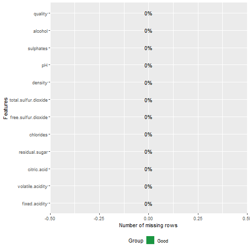
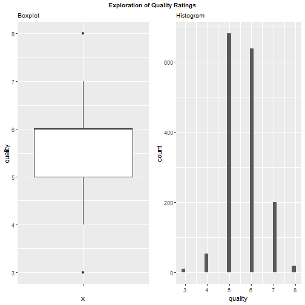
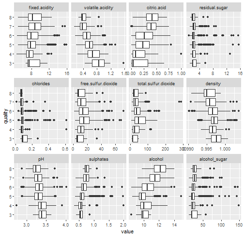
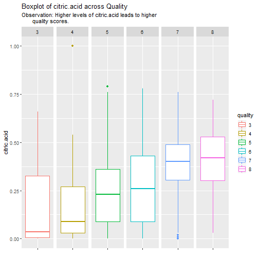
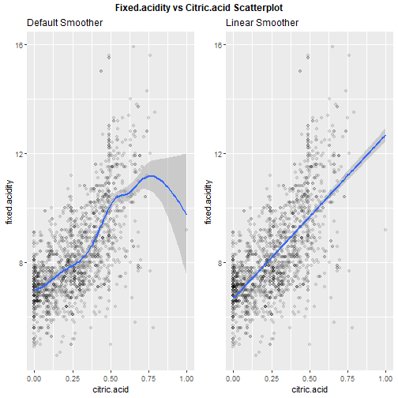
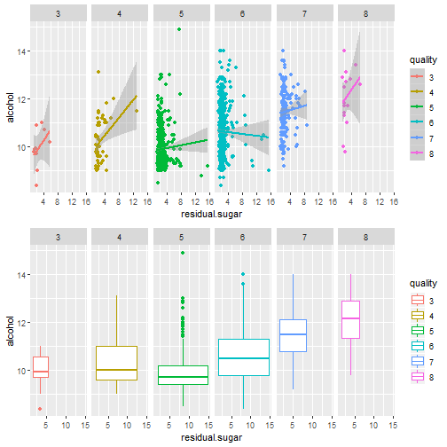
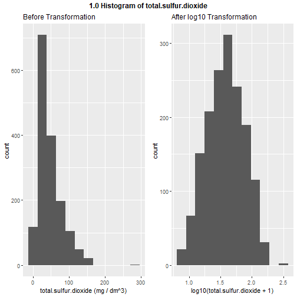
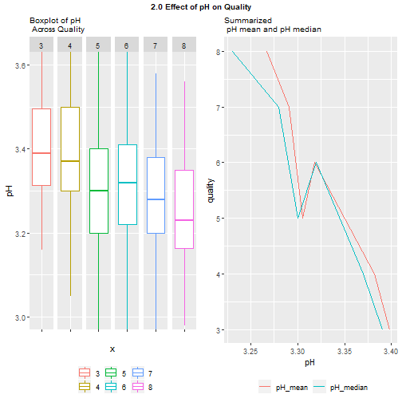
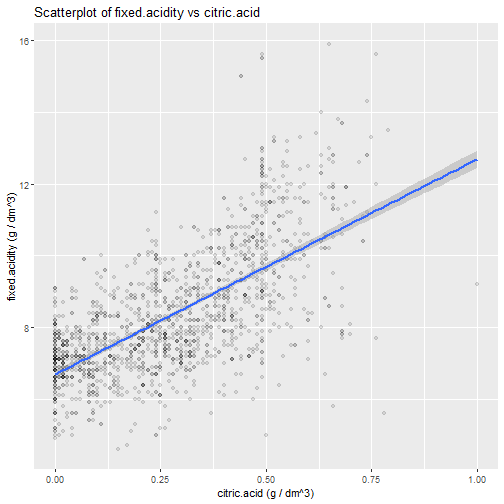

```
## Red Wine Data Table - Wide Format
```

<div style="border: 1px solid #ddd; padding: 5px; overflow-y: scroll; height:300px; overflow-x: scroll; width:100%; "><table class="table" style="margin-left: auto; margin-right: auto;">
 <thead>
  <tr>
   <th style="text-align:right;"> fixed.acidity </th>
   <th style="text-align:right;"> volatile.acidity </th>
   <th style="text-align:right;"> citric.acid </th>
   <th style="text-align:right;"> residual.sugar </th>
   <th style="text-align:right;"> chlorides </th>
   <th style="text-align:right;"> free.sulfur.dioxide </th>
   <th style="text-align:right;"> total.sulfur.dioxide </th>
   <th style="text-align:right;"> density </th>
   <th style="text-align:right;"> pH </th>
   <th style="text-align:right;"> sulphates </th>
   <th style="text-align:right;"> alcohol </th>
   <th style="text-align:right;"> quality </th>
  </tr>
 </thead>
<tbody>
  <tr>
   <td style="text-align:right;"> 7.4 </td>
   <td style="text-align:right;"> 0.700 </td>
   <td style="text-align:right;"> 0.00 </td>
   <td style="text-align:right;"> 1.9 </td>
   <td style="text-align:right;"> 0.076 </td>
   <td style="text-align:right;"> 11 </td>
   <td style="text-align:right;"> 34 </td>
   <td style="text-align:right;"> 0.9978 </td>
   <td style="text-align:right;"> 3.51 </td>
   <td style="text-align:right;"> 0.56 </td>
   <td style="text-align:right;"> 9.4 </td>
   <td style="text-align:right;"> 5 </td>
  </tr>
  <tr>
   <td style="text-align:right;"> 7.8 </td>
   <td style="text-align:right;"> 0.880 </td>
   <td style="text-align:right;"> 0.00 </td>
   <td style="text-align:right;"> 2.6 </td>
   <td style="text-align:right;"> 0.098 </td>
   <td style="text-align:right;"> 25 </td>
   <td style="text-align:right;"> 67 </td>
   <td style="text-align:right;"> 0.9968 </td>
   <td style="text-align:right;"> 3.20 </td>
   <td style="text-align:right;"> 0.68 </td>
   <td style="text-align:right;"> 9.8 </td>
   <td style="text-align:right;"> 5 </td>
  </tr>
  <tr>
   <td style="text-align:right;"> 7.8 </td>
   <td style="text-align:right;"> 0.760 </td>
   <td style="text-align:right;"> 0.04 </td>
   <td style="text-align:right;"> 2.3 </td>
   <td style="text-align:right;"> 0.092 </td>
   <td style="text-align:right;"> 15 </td>
   <td style="text-align:right;"> 54 </td>
   <td style="text-align:right;"> 0.9970 </td>
   <td style="text-align:right;"> 3.26 </td>
   <td style="text-align:right;"> 0.65 </td>
   <td style="text-align:right;"> 9.8 </td>
   <td style="text-align:right;"> 5 </td>
  </tr>
  <tr>
   <td style="text-align:right;"> 11.2 </td>
   <td style="text-align:right;"> 0.280 </td>
   <td style="text-align:right;"> 0.56 </td>
   <td style="text-align:right;"> 1.9 </td>
   <td style="text-align:right;"> 0.075 </td>
   <td style="text-align:right;"> 17 </td>
   <td style="text-align:right;"> 60 </td>
   <td style="text-align:right;"> 0.9980 </td>
   <td style="text-align:right;"> 3.16 </td>
   <td style="text-align:right;"> 0.58 </td>
   <td style="text-align:right;"> 9.8 </td>
   <td style="text-align:right;"> 6 </td>
  </tr>
  <tr>
   <td style="text-align:right;"> 7.4 </td>
   <td style="text-align:right;"> 0.700 </td>
   <td style="text-align:right;"> 0.00 </td>
   <td style="text-align:right;"> 1.9 </td>
   <td style="text-align:right;"> 0.076 </td>
   <td style="text-align:right;"> 11 </td>
   <td style="text-align:right;"> 34 </td>
   <td style="text-align:right;"> 0.9978 </td>
   <td style="text-align:right;"> 3.51 </td>
   <td style="text-align:right;"> 0.56 </td>
   <td style="text-align:right;"> 9.4 </td>
   <td style="text-align:right;"> 5 </td>
  </tr>
  <tr>
   <td style="text-align:right;"> 7.4 </td>
   <td style="text-align:right;"> 0.660 </td>
   <td style="text-align:right;"> 0.00 </td>
   <td style="text-align:right;"> 1.8 </td>
   <td style="text-align:right;"> 0.075 </td>
   <td style="text-align:right;"> 13 </td>
   <td style="text-align:right;"> 40 </td>
   <td style="text-align:right;"> 0.9978 </td>
   <td style="text-align:right;"> 3.51 </td>
   <td style="text-align:right;"> 0.56 </td>
   <td style="text-align:right;"> 9.4 </td>
   <td style="text-align:right;"> 5 </td>
  </tr>
  <tr>
   <td style="text-align:right;"> 7.9 </td>
   <td style="text-align:right;"> 0.600 </td>
   <td style="text-align:right;"> 0.06 </td>
   <td style="text-align:right;"> 1.6 </td>
   <td style="text-align:right;"> 0.069 </td>
   <td style="text-align:right;"> 15 </td>
   <td style="text-align:right;"> 59 </td>
   <td style="text-align:right;"> 0.9964 </td>
   <td style="text-align:right;"> 3.30 </td>
   <td style="text-align:right;"> 0.46 </td>
   <td style="text-align:right;"> 9.4 </td>
   <td style="text-align:right;"> 5 </td>
  </tr>
  <tr>
   <td style="text-align:right;"> 7.3 </td>
   <td style="text-align:right;"> 0.650 </td>
   <td style="text-align:right;"> 0.00 </td>
   <td style="text-align:right;"> 1.2 </td>
   <td style="text-align:right;"> 0.065 </td>
   <td style="text-align:right;"> 15 </td>
   <td style="text-align:right;"> 21 </td>
   <td style="text-align:right;"> 0.9946 </td>
   <td style="text-align:right;"> 3.39 </td>
   <td style="text-align:right;"> 0.47 </td>
   <td style="text-align:right;"> 10.0 </td>
   <td style="text-align:right;"> 7 </td>
  </tr>
  <tr>
   <td style="text-align:right;"> 7.8 </td>
   <td style="text-align:right;"> 0.580 </td>
   <td style="text-align:right;"> 0.02 </td>
   <td style="text-align:right;"> 2.0 </td>
   <td style="text-align:right;"> 0.073 </td>
   <td style="text-align:right;"> 9 </td>
   <td style="text-align:right;"> 18 </td>
   <td style="text-align:right;"> 0.9968 </td>
   <td style="text-align:right;"> 3.36 </td>
   <td style="text-align:right;"> 0.57 </td>
   <td style="text-align:right;"> 9.5 </td>
   <td style="text-align:right;"> 7 </td>
  </tr>
  <tr>
   <td style="text-align:right;"> 7.5 </td>
   <td style="text-align:right;"> 0.500 </td>
   <td style="text-align:right;"> 0.36 </td>
   <td style="text-align:right;"> 6.1 </td>
   <td style="text-align:right;"> 0.071 </td>
   <td style="text-align:right;"> 17 </td>
   <td style="text-align:right;"> 102 </td>
   <td style="text-align:right;"> 0.9978 </td>
   <td style="text-align:right;"> 3.35 </td>
   <td style="text-align:right;"> 0.80 </td>
   <td style="text-align:right;"> 10.5 </td>
   <td style="text-align:right;"> 5 </td>
  </tr>
  <tr>
   <td style="text-align:right;"> 6.7 </td>
   <td style="text-align:right;"> 0.580 </td>
   <td style="text-align:right;"> 0.08 </td>
   <td style="text-align:right;"> 1.8 </td>
   <td style="text-align:right;"> 0.097 </td>
   <td style="text-align:right;"> 15 </td>
   <td style="text-align:right;"> 65 </td>
   <td style="text-align:right;"> 0.9959 </td>
   <td style="text-align:right;"> 3.28 </td>
   <td style="text-align:right;"> 0.54 </td>
   <td style="text-align:right;"> 9.2 </td>
   <td style="text-align:right;"> 5 </td>
  </tr>
  <tr>
   <td style="text-align:right;"> 7.5 </td>
   <td style="text-align:right;"> 0.500 </td>
   <td style="text-align:right;"> 0.36 </td>
   <td style="text-align:right;"> 6.1 </td>
   <td style="text-align:right;"> 0.071 </td>
   <td style="text-align:right;"> 17 </td>
   <td style="text-align:right;"> 102 </td>
   <td style="text-align:right;"> 0.9978 </td>
   <td style="text-align:right;"> 3.35 </td>
   <td style="text-align:right;"> 0.80 </td>
   <td style="text-align:right;"> 10.5 </td>
   <td style="text-align:right;"> 5 </td>
  </tr>
  <tr>
   <td style="text-align:right;"> 5.6 </td>
   <td style="text-align:right;"> 0.615 </td>
   <td style="text-align:right;"> 0.00 </td>
   <td style="text-align:right;"> 1.6 </td>
   <td style="text-align:right;"> 0.089 </td>
   <td style="text-align:right;"> 16 </td>
   <td style="text-align:right;"> 59 </td>
   <td style="text-align:right;"> 0.9943 </td>
   <td style="text-align:right;"> 3.58 </td>
   <td style="text-align:right;"> 0.52 </td>
   <td style="text-align:right;"> 9.9 </td>
   <td style="text-align:right;"> 5 </td>
  </tr>
  <tr>
   <td style="text-align:right;"> 7.8 </td>
   <td style="text-align:right;"> 0.610 </td>
   <td style="text-align:right;"> 0.29 </td>
   <td style="text-align:right;"> 1.6 </td>
   <td style="text-align:right;"> 0.114 </td>
   <td style="text-align:right;"> 9 </td>
   <td style="text-align:right;"> 29 </td>
   <td style="text-align:right;"> 0.9974 </td>
   <td style="text-align:right;"> 3.26 </td>
   <td style="text-align:right;"> 1.56 </td>
   <td style="text-align:right;"> 9.1 </td>
   <td style="text-align:right;"> 5 </td>
  </tr>
  <tr>
   <td style="text-align:right;"> 8.9 </td>
   <td style="text-align:right;"> 0.620 </td>
   <td style="text-align:right;"> 0.18 </td>
   <td style="text-align:right;"> 3.8 </td>
   <td style="text-align:right;"> 0.176 </td>
   <td style="text-align:right;"> 52 </td>
   <td style="text-align:right;"> 145 </td>
   <td style="text-align:right;"> 0.9986 </td>
   <td style="text-align:right;"> 3.16 </td>
   <td style="text-align:right;"> 0.88 </td>
   <td style="text-align:right;"> 9.2 </td>
   <td style="text-align:right;"> 5 </td>
  </tr>
  <tr>
   <td style="text-align:right;"> 8.9 </td>
   <td style="text-align:right;"> 0.620 </td>
   <td style="text-align:right;"> 0.19 </td>
   <td style="text-align:right;"> 3.9 </td>
   <td style="text-align:right;"> 0.170 </td>
   <td style="text-align:right;"> 51 </td>
   <td style="text-align:right;"> 148 </td>
   <td style="text-align:right;"> 0.9986 </td>
   <td style="text-align:right;"> 3.17 </td>
   <td style="text-align:right;"> 0.93 </td>
   <td style="text-align:right;"> 9.2 </td>
   <td style="text-align:right;"> 5 </td>
  </tr>
  <tr>
   <td style="text-align:right;"> 8.5 </td>
   <td style="text-align:right;"> 0.280 </td>
   <td style="text-align:right;"> 0.56 </td>
   <td style="text-align:right;"> 1.8 </td>
   <td style="text-align:right;"> 0.092 </td>
   <td style="text-align:right;"> 35 </td>
   <td style="text-align:right;"> 103 </td>
   <td style="text-align:right;"> 0.9969 </td>
   <td style="text-align:right;"> 3.30 </td>
   <td style="text-align:right;"> 0.75 </td>
   <td style="text-align:right;"> 10.5 </td>
   <td style="text-align:right;"> 7 </td>
  </tr>
  <tr>
   <td style="text-align:right;"> 8.1 </td>
   <td style="text-align:right;"> 0.560 </td>
   <td style="text-align:right;"> 0.28 </td>
   <td style="text-align:right;"> 1.7 </td>
   <td style="text-align:right;"> 0.368 </td>
   <td style="text-align:right;"> 16 </td>
   <td style="text-align:right;"> 56 </td>
   <td style="text-align:right;"> 0.9968 </td>
   <td style="text-align:right;"> 3.11 </td>
   <td style="text-align:right;"> 1.28 </td>
   <td style="text-align:right;"> 9.3 </td>
   <td style="text-align:right;"> 5 </td>
  </tr>
  <tr>
   <td style="text-align:right;"> 7.4 </td>
   <td style="text-align:right;"> 0.590 </td>
   <td style="text-align:right;"> 0.08 </td>
   <td style="text-align:right;"> 4.4 </td>
   <td style="text-align:right;"> 0.086 </td>
   <td style="text-align:right;"> 6 </td>
   <td style="text-align:right;"> 29 </td>
   <td style="text-align:right;"> 0.9974 </td>
   <td style="text-align:right;"> 3.38 </td>
   <td style="text-align:right;"> 0.50 </td>
   <td style="text-align:right;"> 9.0 </td>
   <td style="text-align:right;"> 4 </td>
  </tr>
  <tr>
   <td style="text-align:right;"> 7.9 </td>
   <td style="text-align:right;"> 0.320 </td>
   <td style="text-align:right;"> 0.51 </td>
   <td style="text-align:right;"> 1.8 </td>
   <td style="text-align:right;"> 0.341 </td>
   <td style="text-align:right;"> 17 </td>
   <td style="text-align:right;"> 56 </td>
   <td style="text-align:right;"> 0.9969 </td>
   <td style="text-align:right;"> 3.04 </td>
   <td style="text-align:right;"> 1.08 </td>
   <td style="text-align:right;"> 9.2 </td>
   <td style="text-align:right;"> 6 </td>
  </tr>
</tbody>
</table></div>

```
## Red Wine Data Table - Long Format
```

<div style="border: 1px solid #ddd; padding: 5px; overflow-y: scroll; height:300px; overflow-x: scroll; width:100%; "><table class="table" style="margin-left: auto; margin-right: auto;">
 <thead>
  <tr>
   <th style="text-align:left;"> wine_attribute </th>
   <th style="text-align:right;"> wine_values </th>
  </tr>
 </thead>
<tbody>
  <tr>
   <td style="text-align:left;"> fixed.acidity </td>
   <td style="text-align:right;"> 7.4 </td>
  </tr>
  <tr>
   <td style="text-align:left;"> fixed.acidity </td>
   <td style="text-align:right;"> 7.8 </td>
  </tr>
  <tr>
   <td style="text-align:left;"> fixed.acidity </td>
   <td style="text-align:right;"> 7.8 </td>
  </tr>
  <tr>
   <td style="text-align:left;"> fixed.acidity </td>
   <td style="text-align:right;"> 11.2 </td>
  </tr>
  <tr>
   <td style="text-align:left;"> fixed.acidity </td>
   <td style="text-align:right;"> 7.4 </td>
  </tr>
  <tr>
   <td style="text-align:left;"> fixed.acidity </td>
   <td style="text-align:right;"> 7.4 </td>
  </tr>
  <tr>
   <td style="text-align:left;"> fixed.acidity </td>
   <td style="text-align:right;"> 7.9 </td>
  </tr>
  <tr>
   <td style="text-align:left;"> fixed.acidity </td>
   <td style="text-align:right;"> 7.3 </td>
  </tr>
  <tr>
   <td style="text-align:left;"> fixed.acidity </td>
   <td style="text-align:right;"> 7.8 </td>
  </tr>
  <tr>
   <td style="text-align:left;"> fixed.acidity </td>
   <td style="text-align:right;"> 7.5 </td>
  </tr>
  <tr>
   <td style="text-align:left;"> fixed.acidity </td>
   <td style="text-align:right;"> 6.7 </td>
  </tr>
  <tr>
   <td style="text-align:left;"> fixed.acidity </td>
   <td style="text-align:right;"> 7.5 </td>
  </tr>
  <tr>
   <td style="text-align:left;"> fixed.acidity </td>
   <td style="text-align:right;"> 5.6 </td>
  </tr>
  <tr>
   <td style="text-align:left;"> fixed.acidity </td>
   <td style="text-align:right;"> 7.8 </td>
  </tr>
  <tr>
   <td style="text-align:left;"> fixed.acidity </td>
   <td style="text-align:right;"> 8.9 </td>
  </tr>
  <tr>
   <td style="text-align:left;"> fixed.acidity </td>
   <td style="text-align:right;"> 8.9 </td>
  </tr>
  <tr>
   <td style="text-align:left;"> fixed.acidity </td>
   <td style="text-align:right;"> 8.5 </td>
  </tr>
  <tr>
   <td style="text-align:left;"> fixed.acidity </td>
   <td style="text-align:right;"> 8.1 </td>
  </tr>
  <tr>
   <td style="text-align:left;"> fixed.acidity </td>
   <td style="text-align:right;"> 7.4 </td>
  </tr>
  <tr>
   <td style="text-align:left;"> fixed.acidity </td>
   <td style="text-align:right;"> 7.9 </td>
  </tr>
</tbody>
</table></div>

##General Information about the data
This project explores the quality of Red Wine graded by wine experts based
on sensory data.The dataset contains 1599 instances and 
12 variables.


**Input variables (based on physicochemical tests):**
 
   1. fixed acidity (tartaric acid - g / dm^3)
   2. volatile acidity (acetic acid - g / dm^3)
   3. citric acid (g / dm^3)
   4. residual sugar (g / dm^3)
   5. chlorides (sodium chloride - g / dm^3
   6. free sulfur dioxide (mg / dm^3)
   7. total sulfur dioxide (mg / dm^3)
   8. density (g / cm^3)
   9. pH
   10. sulphates (potassium sulphate - g / dm3)
   11. alcohol (% by volume)

**Output variable (based on sensory data):**

   12. quality (score between 0 and 10)   

The above information can be found in more detail [here](https://s3.amazonaws.com/udacity-hosted-downloads/ud651/wineQualityInfo.txt) 

**Citation<br>**
P. Cortez, A. Cerdeira, F. Almeida, T. Matos and J. Reis. 
  Modeling wine preferences by data mining from physicochemical properties.
  In Decision Support Systems, Elsevier, 47(4):547-553. ISSN: 0167-9236.
  
  
##Reference
https://monashbioinformaticsplatform.github.io/r-more/topics/Rmarkdown.html<br>
https://s3.amazonaws.com/udacity-hosted-downloads/ud651/wineQualityInfo.txt<br>
http://www.stat.cmu.edu/~cshalizi/rmarkdown/#title-author-date-output-format-table-of-contents
https://towardsdatascience.com/simple-fast-exploratory-data-analysis-in-r-with-dataexplorer-package-e055348d9619<br>
https://www.rdocumentation.org/packages/DataExplorer/versions/0.6.0/vignettes/dataexplorer-intro.Rmd<br>
https://cran.r-project.org/web/packages/DataExplorer/vignettes/dataexplorer-intro.html<br>
http://blog.revolutionanalytics.com/2018/02/dataexplorer.html<br>
https://stackoverflow.com/questions/18046051/setting-individual-axis-limits-with-facet-wrap-and-scales-free-in-ggplot2<br>
https://ggplot2.tidyverse.org/reference/facet_grid.html
https://rdrr.io/cran/ggforce/man/facet_wrap_paginate.html
https://stackoverflow.com/questions/14726078/changing-title-in-multiplot-ggplot2-using-grid-arrange
https://stackoverflow.com/questions/10014187/displaying-text-below-the-plot-generated-by-ggplot2


#Univariate Analysis

## Structure of the dataset

```
## 'data.frame':	1599 obs. of  12 variables:
##  $ fixed.acidity       : num  7.4 7.8 7.8 11.2 7.4 7.4 7.9 7.3 7.8 7.5 ...
##  $ volatile.acidity    : num  0.7 0.88 0.76 0.28 0.7 0.66 0.6 0.65 0.58 0.5 ...
##  $ citric.acid         : num  0 0 0.04 0.56 0 0 0.06 0 0.02 0.36 ...
##  $ residual.sugar      : num  1.9 2.6 2.3 1.9 1.9 1.8 1.6 1.2 2 6.1 ...
##  $ chlorides           : num  0.076 0.098 0.092 0.075 0.076 0.075 0.069 0.065 0.073 0.071 ...
##  $ free.sulfur.dioxide : num  11 25 15 17 11 13 15 15 9 17 ...
##  $ total.sulfur.dioxide: num  34 67 54 60 34 40 59 21 18 102 ...
##  $ density             : num  0.998 0.997 0.997 0.998 0.998 ...
##  $ pH                  : num  3.51 3.2 3.26 3.16 3.51 3.51 3.3 3.39 3.36 3.35 ...
##  $ sulphates           : num  0.56 0.68 0.65 0.58 0.56 0.56 0.46 0.47 0.57 0.8 ...
##  $ alcohol             : num  9.4 9.8 9.8 9.8 9.4 9.4 9.4 10 9.5 10.5 ...
##  $ quality             : int  5 5 5 6 5 5 5 7 7 5 ...
```

```
##  fixed.acidity   volatile.acidity  citric.acid    residual.sugar  
##  Min.   : 4.60   Min.   :0.1200   Min.   :0.000   Min.   : 0.900  
##  1st Qu.: 7.10   1st Qu.:0.3900   1st Qu.:0.090   1st Qu.: 1.900  
##  Median : 7.90   Median :0.5200   Median :0.260   Median : 2.200  
##  Mean   : 8.32   Mean   :0.5278   Mean   :0.271   Mean   : 2.539  
##  3rd Qu.: 9.20   3rd Qu.:0.6400   3rd Qu.:0.420   3rd Qu.: 2.600  
##  Max.   :15.90   Max.   :1.5800   Max.   :1.000   Max.   :15.500  
##    chlorides       free.sulfur.dioxide total.sulfur.dioxide
##  Min.   :0.01200   Min.   : 1.00       Min.   :  6.00      
##  1st Qu.:0.07000   1st Qu.: 7.00       1st Qu.: 22.00      
##  Median :0.07900   Median :14.00       Median : 38.00      
##  Mean   :0.08747   Mean   :15.87       Mean   : 46.47      
##  3rd Qu.:0.09000   3rd Qu.:21.00       3rd Qu.: 62.00      
##  Max.   :0.61100   Max.   :72.00       Max.   :289.00      
##     density             pH          sulphates         alcohol     
##  Min.   :0.9901   Min.   :2.740   Min.   :0.3300   Min.   : 8.40  
##  1st Qu.:0.9956   1st Qu.:3.210   1st Qu.:0.5500   1st Qu.: 9.50  
##  Median :0.9968   Median :3.310   Median :0.6200   Median :10.20  
##  Mean   :0.9967   Mean   :3.311   Mean   :0.6581   Mean   :10.42  
##  3rd Qu.:0.9978   3rd Qu.:3.400   3rd Qu.:0.7300   3rd Qu.:11.10  
##  Max.   :1.0037   Max.   :4.010   Max.   :2.0000   Max.   :14.90  
##     quality     
##  Min.   :3.000  
##  1st Qu.:5.000  
##  Median :6.000  
##  Mean   :5.636  
##  3rd Qu.:6.000  
##  Max.   :8.000
```



The dataset contains numeric variables. The outcome variable - quality,  
contains integers between 0 to 10 and this can later be categorized if needed. 
There are also no missing values in the dataset.

## What is/are the main feature(s) of interest in your dataset?


Density and pH have a fairly normal distribution. 
Other attributes with long tails could be shortened by transformation
for easier modeling in future.

Log 10 transformation has helped normalize residual.sugar, sulphates,
total.sulfur.dioxide and volatile.acidity.

Features of interest are volatile.acidity, citric.acid, pH and alcohol content.
There relationship with quality will be further explored in bivariate section.



```
##    Min. 1st Qu.  Median    Mean 3rd Qu.    Max. 
##   3.000   5.000   6.000   5.636   6.000   8.000
```

```
## 
##   3   4   5   6   7   8 
##  10  53 681 638 199  18
```

Quality is another feature of interest in the dataset. Quality score of 5 and 6
have occurances of more than 600 where as the quality score of 3  and 9 occur 
less than 20 times.It can also be observed from the summary statistics as well 
as the boxplot that median and 3rd quartile are same. In addition, the mean is
also very close to the median.

## What other features in the dataset do you think will help support your \n investigation into your feature(s) of interest?
Further investigate if sweetness of wine (residual sugar), increases the 
quality score. Also, investigate if sweet wines with high alcohol content 
increases the qualtiy score.

## Did you create any new variables from existing variables in the dataset?
Out of curosity a new variable was created by multiplying alcohol and sugar to
explore any relationships between the new variable and quality. This will be
further explored in the bivariate section.

#Bivariate Analysis

## Relationships between new variable and quality score


```
## df$quality: 3
##    Min. 1st Qu.  Median    Mean 3rd Qu.    Max. 
##   11.76   17.71   20.09   26.62   33.77   58.14 
## -------------------------------------------------------- 
## df$quality: 4
##    Min. 1st Qu.  Median    Mean 3rd Qu.    Max. 
##   11.96   18.43   21.80   28.23   27.51  148.35 
## -------------------------------------------------------- 
## df$quality: 5
##    Min. 1st Qu.  Median    Mean 3rd Qu.    Max. 
##   11.76   18.43   21.40   25.09   26.26  142.60 
## -------------------------------------------------------- 
## df$quality: 6
##    Min. 1st Qu.  Median    Mean 3rd Qu.    Max. 
##   11.43   19.60   23.24   26.29   27.46  145.95 
## -------------------------------------------------------- 
## df$quality: 7
##    Min. 1st Qu.  Median    Mean 3rd Qu.    Max. 
##   12.00   22.12   27.09   31.28   31.69  102.09 
## -------------------------------------------------------- 
## df$quality: 8
##    Min. 1st Qu.  Median    Mean 3rd Qu.    Max. 
##   17.00   21.77   26.60   31.51   31.86   80.64
```

The quality score gets better as median increase. Also, the quality score gets
somewhat better as mean increases.


## Boxplots between independant variables and quality score



The boxplot indicates the following relationships for:<br> 
volatile.acidity: lower acidity levels could have a better quality score <br> 
citric.acid: slightly higher levels could have better quality score <br>
pH:  lower pH levels have could better quality score <br> 
alcohol: higher alcohol levels could have better quality score <br> 

## Scatterplots between chosen independant variables and quality score

The graphs below explore features of interest such as volatile.acidity, 
citric.acid, alcohol and pH content with quality score as outlined in the
univariate section.



## Correlation Heatmap


The Pairwise Correlation heatmap indicates very strong positive correlation 
between alcohol_sugar and residual.sugar. One reason for the strong correlation
could be that alcohol_sugar is a new variable that was derived by multiplying
alchol and residual.sugar.

## Relationships between independant variables

Two relationships that could be further investigated are:<br>
a. relationship between pH and fixed.acidity (inverse relationship)<br>
b. relationship between citric.acid and fixed.acidity (direct relationship)<br>

### Exploring the relationship between pH vs fixed.acidity


It can be observed from the Fixed.acidity vs pH scatter plot that
pH and fixed.acidity are inversely related.

### Exploring the relationship between citrix.acid vs fixed.acidity



The citric.acid vs fixed.acidity plot shows a direct relationship between 
concentrations of fixed.acidity and citric.acid.

# Multivariate Analysis
Exploring the relationship between residual.sugar, alcohol and quality.
Could sweet wine with high alcohol content have higher quality score?



It can be seen that residual sugar of less than 5, alcohol percent of 10 or 
higher get better quality rating. This means that a wine that is not sweet but
has a higher alcohol content gets a favorably higher rating.

# Final Plots and Summary

## Transformation Plots



Log10 transformation of total.sulfur.dioxide variable is effective in 
normalizing the distribution for future modeling.

## Effect of pH on red wine quality


```
## df$quality: 3
##    Min. 1st Qu.  Median    Mean 3rd Qu.    Max. 
##   3.160   3.312   3.390   3.398   3.495   3.630 
## -------------------------------------------------------- 
## df$quality: 4
##    Min. 1st Qu.  Median    Mean 3rd Qu.    Max. 
##   2.740   3.300   3.370   3.382   3.500   3.900 
## -------------------------------------------------------- 
## df$quality: 5
##    Min. 1st Qu.  Median    Mean 3rd Qu.    Max. 
##   2.880   3.200   3.300   3.305   3.400   3.740 
## -------------------------------------------------------- 
## df$quality: 6
##    Min. 1st Qu.  Median    Mean 3rd Qu.    Max. 
##   2.860   3.220   3.320   3.318   3.410   4.010 
## -------------------------------------------------------- 
## df$quality: 7
##    Min. 1st Qu.  Median    Mean 3rd Qu.    Max. 
##   2.920   3.200   3.280   3.291   3.380   3.780 
## -------------------------------------------------------- 
## df$quality: 8
##    Min. 1st Qu.  Median    Mean 3rd Qu.    Max. 
##   2.880   3.163   3.230   3.267   3.350   3.720
```



The pH is based on a log 10 scale.It can be seen that wines with pH less than
3.3 have a higher quality score. THis means, acidic wines have better quality
score.

## Relationship between citric_acid and fixed_acidity



A direct relationship can be observed between critic.acid and fixed.acidity.
This makes sense as higher concentration of citric.acid could increase the
fixed.acidity concentration, making the red wine more wine more acidic.


#Reflection

In univariate analysis, the focus was to observe the distribution of each 
variable with the aid of boxplots and histograms. Also, applied log10 
transformation to normalize the data. Log10 transformation only worked 
a few variables.It should also be noted that the dependant variable 
(quality) did not have enough data points. Score of 3 only occured 10 times
and score of 8 occured only 18 times. This could cause issues during 
data modeling as fewer data points may make it harder to determine the testing
and training sample.

The correlation plot was very helpful in deciding which variables to explore
during bivariate analysis. The correlation plot helped in identifying
variables that were directly and inversely related.

In multivariate analysis, two independant variables were explored in relation
to the dependant variable and facet_grid feature of ggplot was very helpful.

##Future Improvement

1. Explore other ways of transforming the data such as applying the 
squareroot function to normalize data.

2. The documentation for the red wine dataset states that the quality score
is between 0 to 10 but when the data set was closely examined, there were
no data points for quality scores 0,1,2,3,9,10. Therefore, the dataset
does not fully represent all the quality scores and this limits the extent
of the data exploration in this project. One suggestion is to include more 
of the corresponding data points that are currently not present in 
the dataset.

